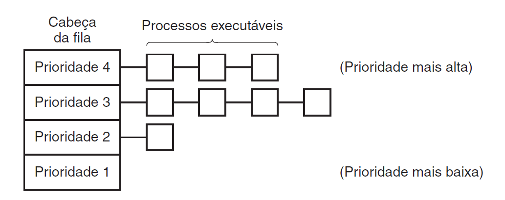
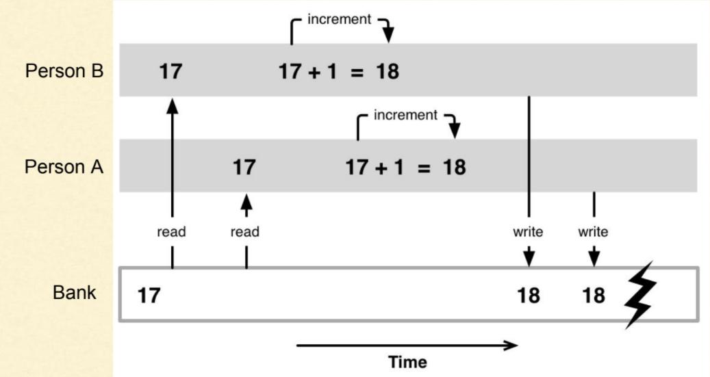

# estudo-threads-java

iniciando estudos de programacao paralela com theads em java

# Oque são threads

Threads em Java são como "mini-processos" que permitem executar várias tarefas ao mesmo tempo dentro de um programa

# criando threads

        //criando nova thread
        Thread thread = new Thread(new Runnable() {
            @Override
            public void run() {
                System.out.println("Hello from a thread");
                throw new RuntimeException("Execuçao de thread");
            }

        });

# Escalonamento de processos
 - é a parte do sistema operacional, responsavel por decidir a ordem de execução de cada thread, decidindo qual sera a proxima thread que ira ocupar os recursos da CPU e inclusive decidir quanto tempo ela irá executar

# Concorrencia de recursos

1 - Race Condition: duas ou mais threads tentam acessar e modificar um recurso ao mesmo tempo, resultando em estados
imprevisiveis

2 - Deadlock: Duas Threads ficam bloqueadas porque cada uma esta esperando que a outra libere o recurso

    //simulando um deadLock
        Thread thread1 = new Thread(new Runnable() {
        @Override
        public void run() {
        System.out.println("Hello from a thread");
            for (int i = 0; i < 100; i++) {
                count++;
            }   
        }
    });

# TreadLocal

o threadLocal permite que cada thread tenha sua propria copia de uma variavel, isso elimina a necessidade de
sincronização
oara variaveis especificas, pois cada thread acessa seu proprio valor

        Thread thread1 = new Thread(new Runnable() {
            @Override
            public void run() {
                ThreadLocal<Integer> threadLocalCounter = ThreadLocal.withInitial(() -> count);
                System.out.println("Hello from a thread");
                for (int i = 0; i < 100; i++) {
                    threadLocalCounter.set(threadLocalCounter.get() + 1);
                }
            }
        });

# Sincronização com Locks

- as tecnicas de sincronização evitam problemas de concorrencias
  - 1 - Synchronized(Bloqueio Implicito)
    um bloco ou um metodo pode ser marcado com synchronized para garantir que apenas uma thread acesse a sessção critica
    de cada vez

        public synchronized void increment(){
            counter ++
        }

      - 2 - Classes de bloqueio(Lock)
        o RetrantLock é mais util que o syncronized porque ele pode ser usado para adquirir um bloqueio por um certo
        periodo evitando um deadLock

             Thread threadRetrantLock = new Thread(new Runnable() {
            @Override
            public void run() {
                ThreadLocal<Integer> threadLocalCounter = ThreadLocal.withInitial(() -> count);
                    System.out.println("Hello from a thread");
                for (int i = 0; i < 100; i++) {
                lock.lock();
                try {
                    count++;
                } finally {
                    lock.unlock();
                        }
                    }
                }
            });

            threadRetrantLock.start();
            threadRetrantLock.join();

